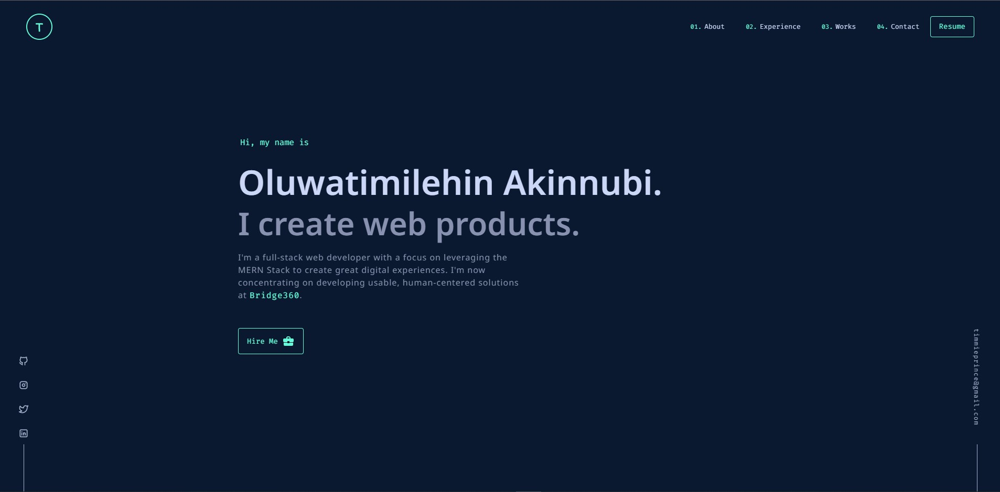

## Portfolio Website v1

[Live Site](https://oluwatimilehin.onrender.com)

This application was built using React and as inpispired by [Brittany Chiang](https://github.com/bchiang7).

As this is my first ever portfolio website, I'll proceed by creating some newer versions with some bunch of new features as time permits.

Wannna say Hi or share some ideas? 👇

- Instagram - [@tea\_\_scripts](https://www.instagram.com/tea__scripts/)
- Frontend Mentor - [@tea-scripts](https://www.frontendmentor.io/profile/tea-scripts)
- Twitter - [@tea\_\_scripts](https://twitter.com/tea__scripts)
